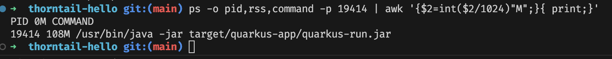
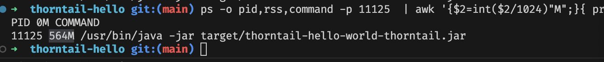

## Run Quarkus
- java -jar quarkus-app/quarkus-run.jar
## Run thorntail
- java -jar thorntail/thorntail-hello-world-thorntail.jar

## Check memory usage
ps -o pid,rss,command -p 11998  | awk '{$2=int($2/1024)"M";}{ print;}'

